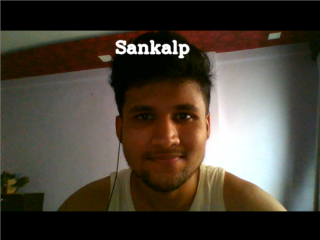

Facial Recognition using one shot learning
===========================================

Pre-requisites
--------------

- Python 3.x
- Deep learning packages like - Numpy,OpenCV etc.

Getting Started
---------------

- Firstly create a Data folder and put images of the people you want the system to recognize in .\Data\ Folder.
- Then change the boolean value of addFaceData variable in index.py file, set it to True and create an empty folder by name "FaceData".
- Then run the index.py file.
Note: If you are running the code for first time, it may take a while to download VGG16 architecture and also the required weights, depending on the model you have selected. (resnet, senet, vgg).

Using The App
-------------

The system would either classify you as one of the people in the database or it may tag you unknown. If you are wearing spectacles make sure either you have the image in database is also captured wearing spectacles or otherwise system may tag you as unknown.

Screenshots
-----------

